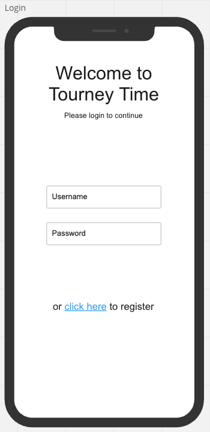
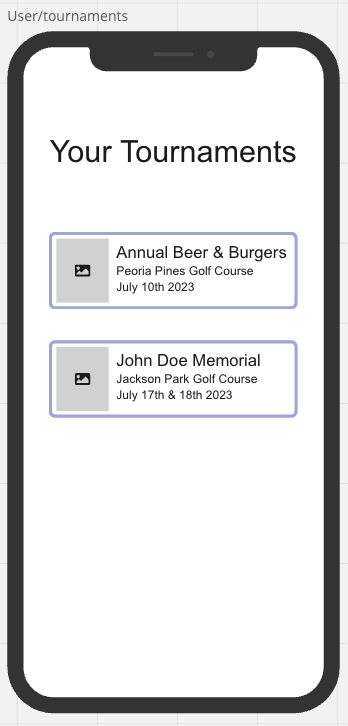

# Tourney Time
Tourney time is an app used to help manage golf tournaments and display scores to the users. Tourney time will all users to track their golf scores for a golf tournament while also being able to see other user's scores. The front end of this app will use React Native to build a mobile app. The back end will use Django to build a postgres database and quickly initiate authroutes. 

## Technologies
### Backend
- Django 
- Django REST framework
- Python

### Frontend -
- React Native
- Expo
- Javascript

## Wireframes

## Sprints
- Friday - Get Django with Postgres up and running. 
- Saturday - Set up RESTful routing in Django
- Sunday - Get initial React Native app created and running in Expo. Test CRUD routes from front end. 
- Monday - Add components/views to front end in React Native. - MVP
- Tuesday - CSS
- Wednesday - Deploy
- Thursday - Deploy/Debug

## ERD

## MVP
- A mobile app built with the React Native framework
- A backend end that stores user data, tournament data and scores in a relational database (postgres)
- Display a live leaderboard that shows all player's current scores
- Display partner pairings for each round of the tournament

## Stretch
- Ability to post comments/images in a community thread within the tournament screen
- Add an algorithm that determines a fair distribution of groups/partners for each round
- Link an API that displays course information for each golf course
